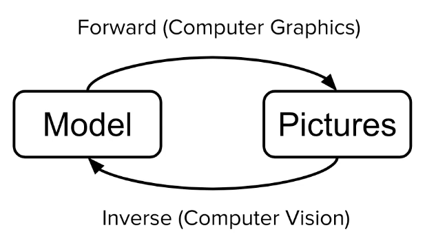
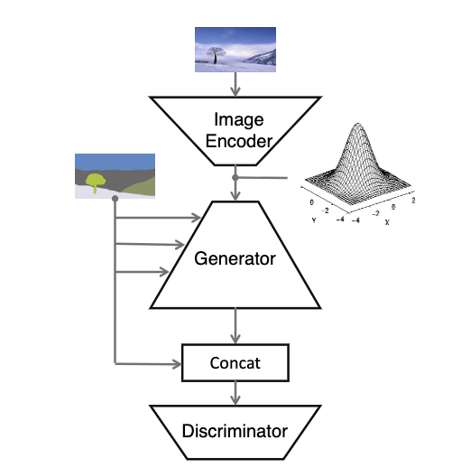
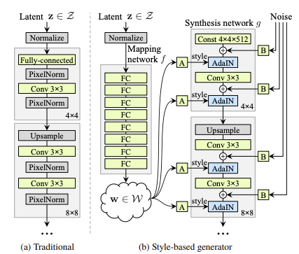

# Awesome Computer Vision(AI) Applications : 
A curated list of awesome computer vision applications, accompanioned with **Introduction**, **landmark research papers**, and **Demos**. Additionally, (1) we orgnaize datasets, models, and metrics in a section for some applications, (2) we showcase some applications a public instagram account. 

## Contributing
Please feel free to send me [pull requests](https://github.com/liyin2015/cv_ai_applications/pulls) or email (li.yin.gravity@gmail.com) to add links.

## Table of Contents

 - [Nenural Rendering](#neural-rendering)

## Introduction to Neural Rendering

[A gentle introduction between neural rendering and traditional computer graphics (classical rendering)](https://dev.to/zumolabs/what-is-neural-rendering-44m0)
## Pre-AI Neural Rendering
## AI knowledge
Concurrently, progress in computer vision and machine learninghave given rise to a new approach to image synthesis and editing, namely deep generative models, mainly GANs. Different GANs are able to  synthesized images with controllable properties such as camera view points and illumination conditons. Controllability: (1) latent space (2) inverse graphics
* [State of the Art on Neural Rending](https://zollhoefer.com/papers/EG20_NeuralSTAR/page.html)
* [Tutorial](https://www.neuralrender.com/)
* [Introduction to GANs](tech_basic/adversarial_network.md)
* [Neural Rendering and Its Applications in Computer Graphics (Presented by Lambda)
](https://www.nvidia.com/en-us/on-demand/session/gtcfall20-a22195/)
## Applications
### (1) Basic 2D (image to image rendering)
* Coloring
* Super-resolution

### (2) Advanced 2D with more controllability
* Sketch to image. 
* Text to image.
* [Segmentation to Image](https://www.instagram.com/p/CZI0nmZokYv/)
* Image to annimation
* Gender exchange
* [Face swap](https://www.instagram.com/p/CYyK9ueIx9U/)
* Aging
* Disfiguration
* Style transfer

Demo: [NVIDIA GauGAN2](http://gaugan.org/gaugan2/), [Youtube Tutorial](https://www.youtube.com/watch?v=y1xnvJf9Uhg)

**Landmark papers:**
* [Isola, Phillip, et al. "Image-to-image translation with conditional adversarial networks." Proceedings of the IEEE conference on computer vision and pattern recognition. 2017.](https://openaccess.thecvf.com/content_cvpr_2017/papers/Isola_Image-To-Image_Translation_With_CVPR_2017_paper.pdf) #cite:11845. This paper is a pioneer one for the image to image one.
* [Liu, M. Y., Breuel, T., & Kautz, J. (2017). Unsupervised image-to-image translation networks. In Advances in neural information processing systems (pp. 700-708).](http://papers.nips.cc/paper/6672-unsupervised-image-to-imagetranslation-networks.pdf) . #cite: 1980.
* pix2pixHD: [Wang, Ting-Chun, et al. "High-resolution image synthesis and semantic manipulation with conditional gans." Proceedings of the IEEE conference on computer vision and pattern recognition. 2018.](https://openaccess.thecvf.com/content_cvpr_2018/papers/Wang_High-Resolution_Image_Synthesis_CVPR_2018_paper.pdf). Segmentation to image.

* SPADE: [Park, Taesung, et al. "Semantic image synthesis with spatially-adaptive normalization." Proceedings of the IEEE/CVF Conference on Computer Vision and Pattern Recognition. 2019.](http://openaccess.thecvf.com/content_CVPR_2019/papers/Park_Semantic_Image_Synthesis_With_Spatially-Adaptive_Normalization_CVPR_2019_paper.pdf). Segmentation+ Style to image.    [code](https://github.com/NVlabs/SPADE), [GauGAN v1 demo](https://www.youtube.com/watch?v=uNv7XBngmLY)
* StackGAN:[Zhang, Han, et al. "Stackgan: Text to photo-realistic image synthesis with stacked generative adversarial networks." Proceedings of the IEEE international conference on computer vision. 2017.](https://openaccess.thecvf.com/content_ICCV_2017/papers/Zhang_StackGAN_Text_to_ICCV_2017_paper.pdf). #cite: 2045. Text -> image.
* [Ramesh, Aditya, et al. "Zero-shot text-to-image generation." arXiv preprint arXiv:2102.12092 (2021).](https://arxiv.org/pdf/2102.12092)

**Leveraging Vision Language models**
* StyleGAN-NADA: [Gal, Rinon, et al. "StyleGAN-NADA: CLIP-Guided Domain Adaptation of Image Generators." (2021).](https://openreview.net/forum?id=8ujQ_BJ7pHZ), [github](https://github.com/rinongal/StyleGAN-nada). Similar to CycleGAN, unpaired $I \rightarrow I$ translation.
* [Patashnik, Or, et al. "Styleclip: Text-driven manipulation of stylegan imagery." Proceedings of the IEEE/CVF International Conference on Computer Vision. 2021.](https://openaccess.thecvf.com/content/ICCV2021/html/Patashnik_StyleCLIP_Text-Driven_Manipulation_of_StyleGAN_Imagery_ICCV_2021_paper.html). #cite: 51, [StyleCLIP Demo](https://replicate.com/orpatashnik/styleclip).

<!-- Curated list of SoTAs:
* PhotoApp:
* [Shen, Yujun, et al. "Interpreting the latent space of gans for semantic face editing." Proceedings of the IEEE/CVF Conference on Computer Vision and Pattern Recognition. 2020.](https://openaccess.thecvf.com/content_CVPR_2020/html/Shen_Interpreting_the_Latent_Space_of_GANs_for_Semantic_Face_Editing_CVPR_2020_paper.html)
* [Tewari, Ayush, et al. "Stylerig: Rigging stylegan for 3d control over portrait images." Proceedings of the IEEE/CVF Conference on Computer Vision and Pattern Recognition. 2020.](https://openaccess.thecvf.com/content_CVPR_2020/html/Tewari_StyleRig_Rigging_StyleGAN_for_3D_Control_Over_Portrait_Images_CVPR_2020_paper.html)
* [Pan, Xingang, et al. "Do 2d gans know 3d shape? unsupervised 3d shape reconstruction from 2d image gans." arXiv preprint arXiv:2011.00844 (2020).](https://arxiv.org/pdf/2011.00844)
* [Pan, Xingang, et al. "Exploiting deep generative prior for versatile image restoration and manipulation." IEEE Transactions on Pattern Analysis and Machine Intelligence (2021).](https://arxiv.org/pdf/2003.13659.pdf%C2%A0) -->

**Controllability:**

* StyleGAN: [Karras, Tero, Samuli Laine, and Timo Aila. "A style-based generator architecture for generative adversarial networks." Proceedings of the IEEE/CVF Conference on Computer Vision and Pattern Recognition. 2019.](https://openaccess.thecvf.com/content_CVPR_2019/papers/Karras_A_Style-Based_Generator_Architecture_for_Generative_Adversarial_Networks_CVPR_2019_paper.pdf). $z \rightarrow I,  + $ SOTA latent space control, #cite: 2993. Resources: [blog](https://towardsdatascience.com/explained-a-style-based-generator-architecture-for-gans-generating-and-tuning-realistic-6cb2be0f431), [Presentation](https://youtu.be/kSLJriaOumA), [demos](https://youtu.be/kSLJriaOumA) (1) Disentangle semantic attributes better than traditional latent space.

* InterFaceGAN: [Shen, Yujun, et al. "Interpreting the latent space of gans for semantic face editing." Proceedings of the IEEE/CVF Conference on Computer Vision and Pattern Recognition. 2020.](https://openaccess.thecvf.com/content_CVPR_2020/html/Shen_Interpreting_the_Latent_Space_of_GANs_for_Semantic_Face_Editing_CVPR_2020_paper.html) What a GAN actually learns with respect to the latent space? How the latent code can be used for image editing? Solution: train SVM on each attribute using binary classification, editing latent space by manipulating around decision boundary.

### (3) 2D to 3D
*  Tech: GANs with 3D control, papers: [photoApp][Controllability]

### (4) Advanced
* sketch to video with movements

## Demo
* [NVIDAI AI Playground](https://www.nvidia.com/en-us/research/ai-playground/)
* [NVIDIA Canvas](https://blogs.nvidia.com/blog/2021/06/23/studio-canvas-app/)
* [Nvidia GauGan2](http://gaugan.org/gaugan2/)
* [StyleGAN-NADA](https://replicate.com/rinongal/stylegan-nada)
* [StyleCLIP](https://replicate.com/orpatashnik/styleclip)
* [replicate.com](https://replicate.com/explore): a model hosting website that you can host your demos too!

## [Datasets, Models, Metrics](tech_basic/adversarial_network.md)

## Reference
* [gans-awesome-applications](https://github.com/nashory/gans-awesome-applications)
* [awesome-neural-rendering](https://github.com/weihaox/awesome-neural-rendering)

