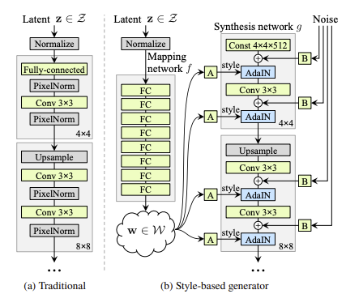

# Models
* GAN

$I\rightarrow I$
* CycleGan:[Zhu, Jun-Yan, et al. "Unpaired image-to-image translation using cycle-consistent adversarial networks." Proceedings of the IEEE international conference on computer vision. 2017.](http://openaccess.thecvf.com/content_ICCV_2017/papers/Zhu_Unpaired_Image-To-Image_Translation_ICCV_2017_paper.pdf), $I\rightarrow I$, #cite: 11438. 

$T\rightarrow I$ Synthesis
* StackGan:[Zhang, Han, et al. "Stackgan: Text to photo-realistic image synthesis with stacked generative adversarial networks." Proceedings of the IEEE international conference on computer vision. 2017.](https://openaccess.thecvf.com/content_ICCV_2017/papers/Zhang_StackGAN_Text_to_ICCV_2017_paper.pdf). $T \rightarrow I  $,#cite: 2045.

$z\rightarrow I $ Synthesis
* ProGAN:[Karras, Tero, et al. "Progressive Growing of GANs for Improved Quality, Stability, and Variation." International Conference on Learning Representations. 2018.](https://openreview.net/forum?id=Hk99zCeAb), $z \rightarrow I, $ #cite: 4000, Resources: [blog](https://towardsdatascience.com/progan-how-nvidia-generated-images-of-unprecedented-quality-51c98ec2cbd2)

* StyleGAN: [Karras, Tero, Samuli Laine, and Timo Aila. "A style-based generator architecture for generative adversarial networks." Proceedings of the IEEE/CVF Conference on Computer Vision and Pattern Recognition. 2019.](https://openaccess.thecvf.com/content_CVPR_2019/papers/Karras_A_Style-Based_Generator_Architecture_for_Generative_Adversarial_Networks_CVPR_2019_paper.pdf). $z \rightarrow I,  + $ SOTA latent space control, #cite: 2993. Resources: [blog](https://towardsdatascience.com/explained-a-style-based-generator-architecture-for-gans-generating-and-tuning-realistic-6cb2be0f431), [Presentation](https://youtu.be/kSLJriaOumA), [demos](https://youtu.be/kSLJriaOumA)
    * StyleGAN2: [Karras, Tero, et al. "Training Generative Adversarial Networks with Limited Data." IEEE Conference on Neural Information Processing Systems;. 2020.](https://arxiv.org/abs/2006.06676) #cite: 298
    * StyleGAN3: [Karras, Tero, et al. "Alias-free generative adversarial networks." Advances in Neural Information Processing Systems 34 (2021).](https://proceedings.neurips.cc/paper/2021/file/076ccd93ad68be51f23707988e934906-Paper.pdf) #cite:38
* BigGAN: [Brock, Andrew, Jeff Donahue, and Karen Simonyan. "Large Scale GAN Training for High Fidelity Natural Image Synthesis." International Conference on Learning Representations. 2018.](https://arxiv.org/abs/1809.11096). #Cite: 2500

# Evaluation and Metrics
* Inception Score(IS): [blog](https://machinelearningmastery.com/how-to-implement-the-inception-score-from-scratch-for-evaluating-generated-images/)
* Fr ́echet Inception Dis-tance (FID)

**Disentanglement of latent space**
* perceptual path length
* linear separability

# Datasets
* 