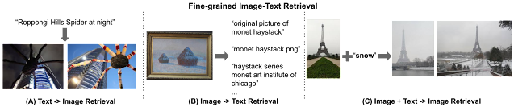
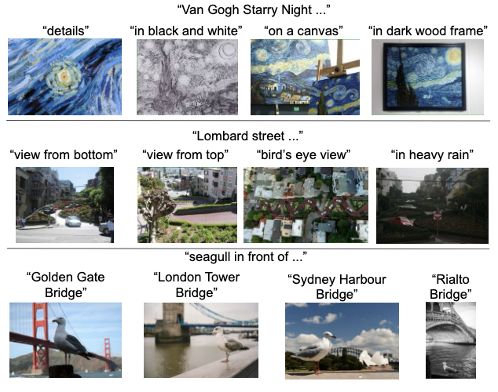
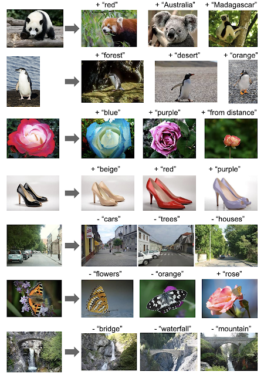
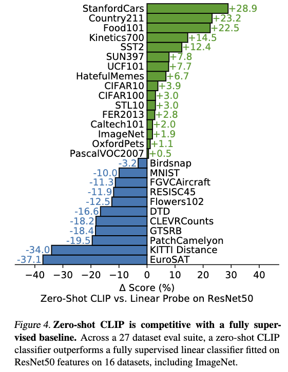

# Vision Language Models (VL)
Vision lanaguage models are often trained with large-scale (text, image) pairs dataset that crawled from websites.

There are different vision lanaguage models. Other than the  conventional  tasks such as Visual question answering(VQA) and image captioning, the field and the promising futures belongs to Visual-language models that are pretrained with self-supervised learning methods. These pretrained models have already enabled a variety of applications:
* Zero-shot classification (based on representation learning)
* Simple linear-prob classification

Survey paper:
* https://arxiv.org/pdf/1912.11872.pdf

## Pretraining
With vision language pretraining, the models can enable zero-shot or linear prob (simple classifier using features from VL models) downstream tasks.

## Application
* image captioning (given image, it can retrive texts)
* image retrieval via text prompt
* image + text to image retrieval

 

* text to image generation(indirectly with adaptation to GAN generator)
* zero-shot classification
* classification(few shot classification)
* Backbone to downstream tasks

Waiting to explore applications:
* Enabling object detection
## Landmark papers:

 

* CLIP: [Radford, Alec, et al. "Learning transferable visual models from natural language supervision." International Conference on Machine Learning. PMLR, 2021.](http://proceedings.mlr.press/v139/radford21a/radford21a.pdf). #cite: 500. Contrastive Language-Image Pre-training. If you want to see how the model's representation and task learning via zero-shot transfer and simple linear prob, check out the [code](https://github.com/openai/CLIP). 400M dataset.
* ALIGN: [Jia, Chao, et al. "Scaling up visual and vision-language representation learning with noisy text supervision." International Conference on Machine Learning. PMLR, 2021.](http://proceedings.mlr.press/v139/jia21b.html). #cite:120 . [blog](https://ai.googleblog.com/2021/05/align-scaling-up-visual-and-vision.html). 1.8B noisy image-text pairs.
* ConVIRT: 

## Demos
* [CLIP playground](https://gpt3demo.com/apps/clip-playground) However, seems not working right now.

## Datasets
* [Conceptual Captions](https://ai.google.com/research/ConceptualCaptions/)
* [Visual Genome Dense Captions](https://visualgenome.org/)
## Other resources
* [awesome-vision-and-language](https://github.com/sangminwoo/awesome-vision-and-language)
* [awesome-vision-language-pretraining-papers](https://github.com/yuewang-cuhk/awesome-vision-language-pretraining-papers)